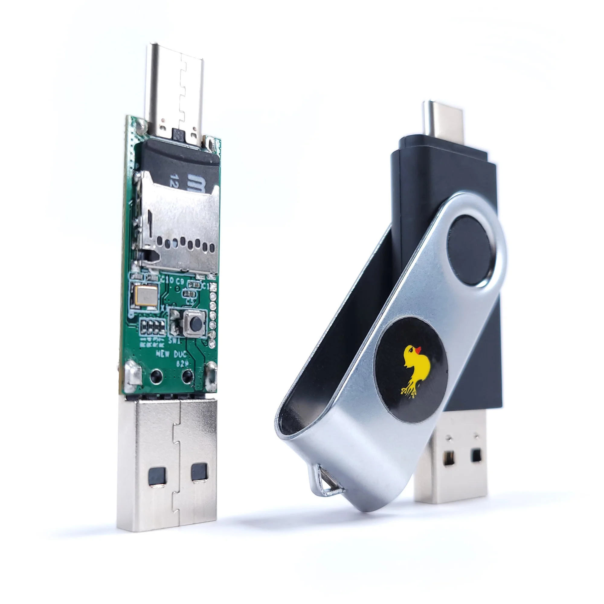
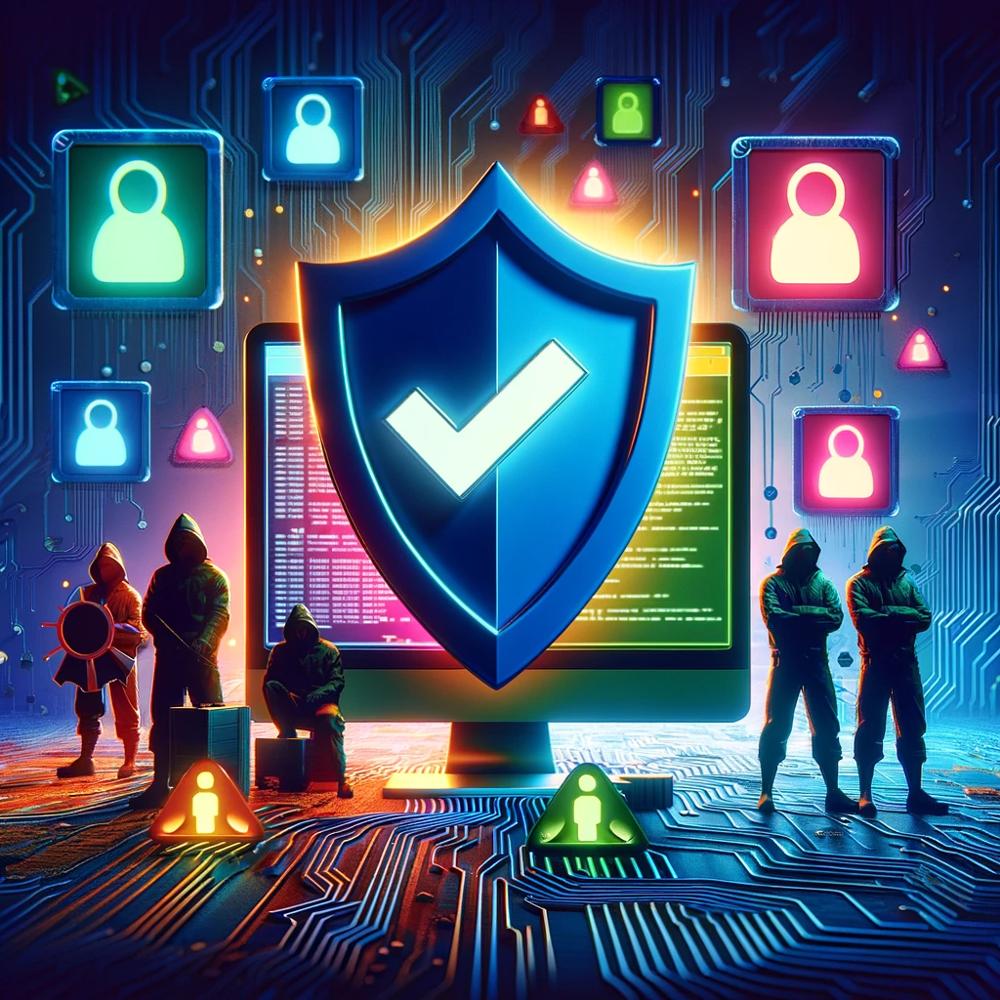
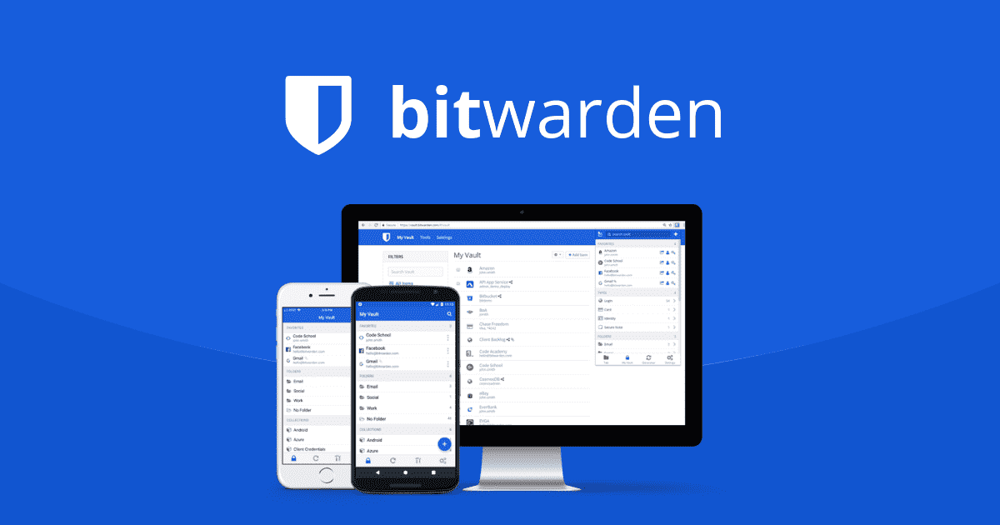

# Sus datos, tu responsabilidad

### Según la AEPD...

> Dato de carácter personal no es solo el nombre y los apellidos de una persona, sino toda
información referida a esta o que pueda identificarla<!-- .element: class="fragment" -->

Note: 
El nombre y apellidos de un alumno, de sus padres, su dirección, su número de teléfono o su correo electrónico son datos de carácter personal. También lo son las imágenes de los alumnos o, por ejemplo, la profesión, los estudios o el lugar donde trabajan los padres, o su número de cuenta bancaria.

### Reflexiona, sobre...

- ¿Dónde están los datos de mi alumnado?

- ¿Puedo usar cualquier aplicación libremente?<!-- .element: class="fragment" -->

- ¿Quién tiene la responsabilidad?<!-- .element: class="fragment" -->

###

- Si quiero comunicarme con mi alumnado... ¿Qué opciones tengo?

- ¿Necesito su permiso para utilizar información personal?<!-- .element: class="fragment" -->

- ¿Puedo realizar fotografías o vídeos sin consentimiento?<!-- .element: class="fragment" -->

---

### LOPD en acción

### Legitimación para el tratamiento de datos

- El RGPD y la LOPDGDD establece en 14 años la edad límite para prestar el consentimiento.<!-- .element: class="fragment" -->

- Datos necesarios para la función educativa.<!-- .element: class="fragment" -->

- Ejemplos de legitimación.<!-- .element: class="fragment" -->

Note:
La ley de educación legitima a los centros a recabar datos de carácter personal para la función docente y orientadora de los alumnos en referencia a:
- El origen y ambiente familiar y social.
- Las características o condiciones personales.
- El desarrollo y resultados de su escolarización.
- Las circunstancias cuyo conocimiento sea necesario para educar y orientar a los alumnos.

### A tener en cuenta...
- Los datos personales no podrán usarse para fines diferentes al educativo (función docente y orientadora).<!-- .element: class="fragment" -->

- El personal que acceda a los datos personales está sometido al deber de guardar secreto art.5 LOPDGDD.<!-- .element: class="fragment" -->

### 

### Recogida de datos por los centros educativos

### 
- ¿Se pueden recabar datos sobre la situación familiar de los padres de los alumnos?
<!-- .element: class="fragment" -->

###
- ¿Se pueden recabar datos de salud?
<!-- .element: class="fragment" -->

###
- ¿Se pueden recabar datos biométricos?
<!-- .element: class="fragment" -->

### 
- ¿Se pueden recabar imágenes de los alumnos para el expediente académico?
<!-- .element: class="fragment" -->

###
- ¿Se pueden recabar datos para finalidades distintas de la función propiamente
educativa? 
<!-- .element: class="fragment" -->

### 
- ¿Puede un centro educativo acceder al contenido de dispositivos electrónicos de los alumnos, como los sistemas de mensajería instantánea (WhatsApp) o redes sociales?
<!-- .element: class="fragment" -->

### Tratamiento de los datos de los alumnos

###
- ¿Se pueden hacer públicas las calificaciones escolares?

<!-- .element: class="fragment" -->

###
- ¿Pueden los profesores facilitar las calificaciones oralmente en clase? 
<!-- .element: class="fragment" -->

###
- ¿Pueden los padres solicitar las calificaciones de sus hijos mayores de edad? 
<!-- .element: class="fragment" -->

### 
- ¿Pueden los padres acceder a la información sobre las ausencias escolares de
sus hijos si estos son mayores de edad?
<!-- .element: class="fragment" -->

### 
- Acceso a la información académica por padres separados 
<!-- .element: class="fragment" -->

###
- ¿Se pueden comunicar los datos a instituciones, entidades o empresas que van
a ser visitadas por los alumnos en una actividad extraescolar, por ejemplo, una
exposición, un museo, una fábrica o un club deportivo?
<!-- .element: class="fragment" -->

###
- ¿Se pueden comunicar los datos a los Servicios Sanitarios autonómicos, o a un
ayuntamiento para campañas de vacunación o programas de salud escolar
(bucodental, alimentaria, etc.)? 
<!-- .element: class="fragment" -->

### Tratamiento de las imágenes de los alumnos

### 
- ¿Pueden los centros educativos captar imágenes de los alumnos durante las
actividades escolares? 
<!-- .element: class="fragment" -->

### 
- ¿Puede un profesor grabar imágenes de los alumnos para una actividad escolar?
<!-- .element: class="fragment" -->

### 
- ¿Pueden los familiares de los alumnos que participan en un evento abierto a las familias grabar imágenes del evento? 
<!-- .element: class="fragment" -->

### 
- Si unos padres se niegan a que se tomen imágenes de su hijo en un evento en
el centro educativo, ¿se ha de cancelar dicho evento?  
<!-- .element: class="fragment" -->

### 
- ¿Pueden los centros escolares prohibir la toma de imágenes en sus
instalaciones?  
<!-- .element: class="fragment" -->

### Tratamiento de datos en internet

###
- ¿Quién es el responsable del tratamiento de los datos personales de los
alumnos en las plataformas educativas? 
<!-- .element: class="fragment" -->

### 
- ¿Estamos legitimados a usar cualquier plataforma educativa? 
<!-- .element: class="fragment" -->

### 
- ¿Se pueden publicar en la web del centro los datos de los profesores, tutores y otros responsables del centro? 
<!-- .element: class="fragment" -->

###
- ¿Puede publicarse en la web del centro información relativa a los alumnos,
como fotografías o vídeos? 
<!-- .element: class="fragment" -->

### 
<!-- .element: class="fragment" -->

###
- ¿Pueden publicarse datos personales de los alumnos en, ...?
  - La página web del centro educativo
  - El blog del centro ducativo 
  - Redes sociales

### Videovigilancia

###
- ¿Se pueden instalar cámaras de videovigilancia en todas las instalaciones
del colegio?
<!-- .element: class="fragment" -->

###
- ¿Se pueden instalar cámaras de videovigilancia en las aulas alegando motivos
de conflictividad?
<!-- .element: class="fragment" -->

###
- ¿Se pueden instalar cámaras de videovigilancia en los patios de recreo y
comedores?
<!-- .element: class="fragment" -->

###
- ¿Se debe informar de la existencia de un sistema de videovigilancia?
<!-- .element: class="fragment" -->

---

### Decálogo

### 
- Necesitamos sus datos personales

### 
- Estamos legitimados

### 
- Con responsabilidad

### 
- Informando de cada acción

### 
- Pediendo permiso para el uso de Apps

### 
- El centro debe disponer de una guía

### 
- Comunicaciones por canales oficiales

### 
- No se recomienda el uso de whatsapp

### 
- Grabar si, difudir No

### 
- ¿Evento escolar? Avisemos a las familias de la NO difusión.

## Desmitificando la ciberseguridad

---

## Nuetro objetivo: Guía de Supervivencia

---

## Defensa en profundidad y seguridad por capas

---

## Protege tu espacio digital

---

### Cuando los USB se vuelven contra nosotros

### 

* Daño físico: "USBs pueden quemar equipos".

* Malware oculto: "Riesgo de virus y spyware".<!-- .element: class="fragment" -->

* Robo de datos: "Extracción silenciosa de info".<!-- .element: class="fragment" -->

* Infiltración de red: "Puerta trasera a sistemas".<!-- .element: class="fragment" -->

### El Pato en Acción: Demostrando la Seguridad USB"

### 

* Desconfiar y no conectar a nuestros equipos dispositivos encontrados en espacios públicos o de origen desconocido.

* Deshabilitar la función de autoarranque de dispositivos USB. <!-- .element: class="fragment" -->

* Disponer de un antivirus activo y debidamente actualizado.<!-- .element: class="fragment" -->

### Deshabilitar la función de autoarranque de dispositivos USB

Note:
De este modo, si por error conectamos un dispositivo USB infectado a nuestro equipo, el malware o las herramientas que contenga no se activarán automáticamente, y podremos analizar y eliminar esas amenazas con un antivirus. En Windows, por ejemplo, para hacerlo deberemos acceder al icono de Windows > Configuración > Dispositivos > Reproducción automática y desactivar esta opción.

###

* Una vez conectado, haremos clic derecho sobre él.

* Luego, haremos clic sobre “Analizar con…”

---

### Mantenimiento y salud digital

Note:
En esta sección, destacaremos la importancia del mantenimiento regular y la higiene digital. Veremos cómo una adecuada gestión de la limpieza digital mejora la funcionalidad de nuestros dispositivos y refuerza la seguridad. Examinaremos estrategias para mantener nuestros sistemas actualizados y cómo gestionar de manera segura los permisos de las aplicaciones. También discutiremos la importancia de realizar descargas conscientes. 

### El riesgo del síndrome de Diógenes digital

Note: 
* Cada app extra es un riesgo potencial. 

Cada aplicación sin uso puede ser un talón de Aquiles en la armadura digital que salvaguarda nuestra información. Es importante abordar este desorden con una estrategia de limpieza digital meticulosa, eliminando lo que ya no sirve.

### 

* Dedica un momento a revisar todas las aplicaciones instaladas en tu dispositivo

* ¿Cuándo fue la última vez que utilizaste cada una? <!-- .element: class="fragment" -->

* ¿Su presencia es justificable?<!-- .element: class="fragment" -->

### 

* Evitar instalaciones innecesarias: seguridad y eficiencia.
<!-- .element: class="fragment" -->

* Priorizar herramientas esenciales. <!-- .element: class="fragment" -->

* Revisión periódica de aplicaciones en uso. <!-- .element: class="fragment" -->

### Actualizaciones: Escudo digital

Note: 
Tras realizar una limpieza digital exhaustiva en nuestros dispositivos, es importante entender que este esfuerzo, aunque importante, no es suficiente para asegurar una protección completa. La naturaleza dinámica de las amenazas requiere de medidas adicionales, siendo las actualizaciones que nos ofrecen los fabricantes de software una de ellas.

Las actualizaciones proporcionan correcciones críticas para los sistemas operativos y aplicaciones, abarcando desde ordenadores y smartphones hasta consolas y dispositivos inteligentes. Al mantener nuestros dispositivos al día, cerramos activamente puertas a potenciales vulnerabilidades, actuando como un escudo digital frente a las amenazas más recientes.

* [https://nvd.nist.gov/vuln](https://nvd.nist.gov/vuln)

### 

* Comprobar el estado de actualización de todos nuestros dispositivos y aplicaciones. 

* Elegir la opción de actualizaciones automáticas, siempre que esté disponible. <!-- .element: class="fragment" -->

* No posponer la instalación de actualizaciones, especialmente las relacionadas con sistemas operativos, navegadores y antivirus. <!-- .element: class="fragment" -->

### Permisos a tu medida

Note: 
Tras depurar nuestro entorno digital y actualizar sistemas y aplicaciones, surge una pregunta esencial: ¿sabemos realmente a qué información acceden las aplicaciones que usamos? 

Muchas veces, las aplicaciones gratuitas solicitan permisos para acceder a funciones esenciales, como usar el micrófono para una app de grabación. Sin embargo, algunas van más allá, pidiendo acceso a tu ubicación, contactos y más, lo cual puede parecer innecesario. Este es el "negocio" detrás de muchas apps gratuitas: recopilan tu información personal y la utilizan con fines publicitarios o simplemente venderla al mejor postor. Y lo más sorprendente es que, al instalar estas apps y aceptar sus permisos, les damos legalmente el derecho a hacerlo.

### 

* Verificar que las aplicaciones solo accedan a permisos imprescindibles.

* Modificar los permisos que no sean necesarios para realizar las funciones de la aplicación o que comprometan la privacidad. <!-- .element: class="fragment" -->

* Utilizar herramientas externas para gestionar los permisos de forma efectiva. <!-- .element: class="fragment" -->

## Un poco de ayuda extra...

### Exodus privacy

[Descarga la app]((https://play.google.com/store/apps/details?id=org.eu.exodus_privacy.exodusprivacy)) y consulta la [web de la organizacion Exodus](https://reports.exodus-privacy.eu.org/es/) para más información.

<small>Ejemplo: [informe de la aplicación del McDonald's](https://reports.exodus-privacy.eu.org/es/reports/com.mcdo.mcdonalds/latest/). </small>

### Guardianes de contraseñas seguras

Note:
Las contraseñas actúan como los guardianes de nuestra vida digital, abriendo y cerrando el acceso a toda nuestra información

### Evaluando nuestra primera línea de defensa

### 

* Visita [NordPass Secure Password](https://nordpass.com/es/secure-password/).

* Introduce la contraseña que desees evaluar.<!-- .element: class="fragment" -->

* Analiza el resultado, prestando atención en la solidez, tiempo estimado para descifrar la contraseña, y otros indicadores proporcionados.<!-- .element: class="fragment" -->

### ¿Estás seguro de que nunca has sido hackeado?

[haveibeenpwned](https://haveibeenpwned.com/)

### Construyendo muros robustos

###

* Longitud mínima, al menos 12 caracteres.

* Utiliza una mezcla de mayúsculas, minúsculas, números y símbolos.<!-- .element: class="fragment" -->

* No utilices información personal.<!-- .element: class="fragment" -->

* Evita patrones comunes: secuencias como "1234" o "abcd" son extremadamente inseguras.<!-- .element: class="fragment" -->

* La regla de oro, diversificar: No reutilices contraseñas. <!-- .element: class="fragment" -->

* Considera actualizar tus contraseñas cada cierto tiempo.<!-- .element: class="fragment" -->

### Gestores de contraseñas

Note:
Llegados a este punto, nos enfrentamos a una paradoja de la era digital: cuanto más complejas y seguras hacemos nuestras contraseñas, más nos cuesta recordarlas y administrarlas. Aquí es donde entran en juego los gestores de contraseñas, verdaderos cofres digitales que nos liberan de la carga de memorizar incontables claves.

### 

¿Las ventajas? 

* Primero, la seguridad. Cada contraseña es única y compleja, un enigma para los ciberdelincuentes. <!-- .element: class="fragment" -->

* Segundo, la comodidad. Olvídate de memorizar o escribir contraseñas; tu gestor lo hace por ti. <!-- .element: class="fragment" -->

* Y tercero, la eficiencia. Con todas tus claves en un solo lugar, gestionar tus cuentas es más rápido y sencillo.<!-- .element: class="fragment" -->

###

<small>[Enlace a la web de Bitwarden](https://bitwarden.com/)</small>

---

## Protección de amenazas en línea

---

### Detectives digitales

Note:
Nos enfocaremos endetectar señales de alerta, como ofertas que parecen demasiado buenas para ser verdad y mensajes que presionan para actuar de manera urgente, tácticas comunes para engañar a los desprevenidos. 

### Fraudes digitales

### Riesgos comunes en internet

* Phishing y sitios falsos.

* Conexiones no seguras.

* Descargas peligrosas.

### Delivery... formas de hacértela llegar

* Correos electrónicos

* Mensajes de texto

* Llamadas telefónicas

* Redes sociales

* Anuncios online

### Navegando entre sitios webs fraudulentos

Note:
Los ciberdelincuentes crean sitios web fraudulentos que buscan robar información confidencial, como contraseñas, detalles de pago o información personal que pueden usar para robar tu identidad. Algunos sitios web falsos pueden incluso infectar tu dispositivo con malware o engañarte para que compres productos inexistentes o falsificados.

No te dejes engañar por un diseño aparentemente profesional. Los ciberdelincuentes han perfeccionado sus técnicas y pueden crear sitios web que parezcan legítimos. Investiga la reputación y la procedencia del sitio antes de confiar en él.

Mantén una actitud escéptica y crítica al navegar. Si algo te parece demasiado bueno para ser verdad, probablemente lo sea. 

### Cómo identificar sitios web falsos

* Revisión de URL y dominio<!-- .element: class="fragment" -->

* HTTPS en la URL<!-- .element: class="fragment" -->

* Candado en la barra<!-- .element: class="fragment" -->

* Certificados válidos<!-- .element: class="fragment" -->

###

* Verifica el sitio web, [desenmascara.me](https://desenmascara.me/)

* Verifica la antiguedad del dominio, [Whois lookup](https://whois.domaintools.com/)
<!-- .element: class="fragment" -->

* Buscar opiniones y reseñas<!-- .element: class="fragment" -->

* No te dejes engañar por “señales de confianza”<!-- .element: class="fragment" -->

### Stay secure, Stay informed

* La primera clave para protegerse de las estafas en línea es estar al día con las últimas tácticas.

<small>[Suscripción a los boletines de INCIBE](https://www.incibe.es/ciudadania/simplenews/subscriptions/landing)</small>

### Nunca, never, jamais, hacer clic en enlaces no solicitados

Note:
La prevención es la clave en la protección contra las estafas en línea, y una regla fundamental es evitar hacer clic en enlaces no solicitados.

Los estafadores suelen utilizar enlaces maliciosos en correos electrónicos o mensajes para dirigir a sitios web falsos o descargar malware. 

### Herramientas para comprobar la seguridad de una URL

* Analizadores de URL: [VirusTotal](https://www.virustotal.com/), [URLScan](https://urlscan.io/) o [Google Safe Browsing](https://transparencyreport.google.com/safe-browsing/search).
* Extensiones de navegador: [Web of Trust](https://www.mywot.com/).

* Servicios de verificación de enlaces: [LongURL](https://longurl.in/) o [CheckShortURL](https://checkshorturl.com/).

Note:

* Analizadores de URL: Sitios web como [VirusTotal](https://www.virustotal.com/), [URLScan](https://urlscan.io/) o [Google Safe Browsing](https://transparencyreport.google.com/safe-browsing/search) permiten escanear una dirección web y detectar si está asociada a actividades maliciosas.

* Extensiones de navegador: Complementos para el navegador como [Web of Trust](https://www.mywot.com/), pueden avisarte sobre sitios web peligrosos mientras navegas.

* Servicios de verificación de enlaces: Plataformas como [LongURL](https://longurl.in/) o [CheckShortURL](https://checkshorturl.com/) permiten analizar enlaces acortados y determinar su destino real.

### Di NO al software pirata

Note: El software pirata conlleva una serie de peligros que no deberían ignorarse. Uno de los principales problemas es la presencia de malware y virus. Estos programas maliciosos pueden dañar gravemente tu dispositivo, robar tus datos personales e incluso secuestrar tu sistema para pedir un rescate. 

### Si no lo veo, no lo creo

Para asegurarnos de que un archivo es seguro antes de abrirlo o ejecutarlo, [VirusTotal](https://www.virustotal.com/gui/home/upload).

### Siempre existen alternativas...

* [Alternativeto.net](https://alternativeto.net/)

* [Filepuma.com](https://www.filepuma.com/)

* [Majorgeeks.com](https://www.majorgeeks.com/)

Note: 
* Alternativeto.net: Esta página no aloja los programas en sus servidores, pero enlaza directamente a las páginas oficiales de cada aplicación, ofreciendo alternativas legales y seguras a programas populares.
* Filepuma.com: Un repositorio que destaca por su simplicidad y organización, ofreciendo una amplia variedad de programas con capturas de pantalla y versiones antiguas para descargar.
* Majorgeeks.com: Especializada en la difusión de freeware, esta web ofrece software propietario de alta calidad de forma gratuita, sin la necesidad de instalar software adicional no deseado.

---

### Correos fortificados

Note: Vamos a ver estrategias para fortalecer la protección de nuestros correos, desde la configuración de filtros antispam hasta el uso de cifrado de extremo a extremo. Además, exploraremos la importancia de la autenticación de dos factores y otras medidas de seguridad para salvaguardar la confidencialidad y la integridad de nuestra correspondencia digital.

### Blindando tu buzón

Note: Como hemos visto anteriormente, los ciberdelincuentes utilizan el correo electrónico como una de las principales vías de ataque, enviando mensajes maliciosos diseñados para robar información, instalar malware o estafar a las víctimas.

Mantener un sistema de filtrado antispam robusto es clave para evitar que estos correos dañinos lleguen a tu bandeja de entrada.

### Los filtros antispam aprenden, ayúdalos...

* Marcar correos como spam, en lugar de eliminarlos, ayuda al filtro a aprender.<!-- .element: class="fragment" -->

* Marcar correos legítimos en spam como "No es spam" enseña al filtro a reconocerlos.<!-- .element: class="fragment" -->

### Buenas prácticas

* No publiques tu dirección de correo en sitios web, evita que sea recopilada por spammers<!-- .element: class="fragment" -->

* Si es imprescindible: mrivsan736[arroba]g[punto]educaand[punto]es<!-- .element: class="fragment" -->

* Evita darte de baja de correos spam para no confirmar cuentas activas<!-- .element: class="fragment" -->

* Utiliza un 'correo basura' para registrarte en sitios menos importantes<!-- .element: class="fragment" -->

### SimpleLogin: Tu aliado en la protección de la privacidad en línea

<small>[SimpleLogin](https://simplelogin.io/)</small> 

Note: Se puede utilizar en conjunto con servicios de correo electrónico como Gmail, Yahoo, Outlook y Thunderbird, y por supuesto, ProtonMail, brindando una capa adicional de privacidad y seguridad.

### Maestro...creo que me he dejado la sesión abierta

### 

---

## La LOPD y su aplicación en el ámbito educativo

## Sus datos, nuestra responsabilidad

### Según la AEPD...

> Dato de carácter personal no es solo el nombre y los apellidos de una persona, sino toda
información referida a esta o que pueda identificarla<!-- .element: class="fragment" -->

Note: 
El nombre y apellidos de un alumno, de sus padres, su dirección, su número de teléfono o su correo electrónico son datos de carácter personal. También lo son las imágenes de los alumnos o, por ejemplo, la profesión, los estudios o el lugar donde trabajan los padres, o su número de cuenta bancaria.

### Reflexiona, sobre...

- ¿Dónde están los datos de mi alumnado?

- ¿Puedo usar cualquier aplicación libremente?<!-- .element: class="fragment" -->

- ¿Quién tiene la responsabilidad?<!-- .element: class="fragment" -->

###

- Si quiero comunicarme con mi alumnado... ¿Qué opciones tengo?

- ¿Necesito su permiso para utilizar información personal?<!-- .element: class="fragment" -->

- ¿Puedo realizar fotografías o vídeos sin consentimiento?<!-- .element: class="fragment" -->

### Decálogo

### 
- Necesitamos sus datos personales

### 
- Estamos legitimados

### 
- Con responsabilidad

### 
- Informando de cada acción

### 
- Pediendo permiso para el uso de Apps

### 
- El centro debe disponer de una guía

### 
- Comunicaciones por canales oficiales

### 
- No se recomienda el uso de whatsapp

### 
- Grabar si, difudir No

### 
- ¿Evento escolar? Avisemos a las familias de la NO difusión.

---

## ¡Objetivo cumplido!

---

## La inteligencia artificial

---

## La Inteligencia Artificial Generativa (IAG)

Generación y edición

Texto (LLM - Large Language Model) <!-- .element: class="fragment" -->

Audio <!-- .element: class="fragment" -->

Imagen → Vídeo <!-- .element: class="fragment" -->

3D <!-- .element: class="fragment" -->

---

## Impacto y retos

###

* Generación de contenido falso y engañoso a escala

* Estafas mas sofisticadas<!-- .element: class="fragment" -->

* Aumento de ataques a escala con personalización<!-- .element: class="fragment" -->

* Dificultad creciente para detectar contenido falso generado por IA<!-- .element: class="fragment" -->

---

## Don't panic!

Note: Sí bien es cierto que la Inteligencia Artificial (IA) introduce numerosos retos en cuanto a la sofisticación de las amenazas cibernéticas, pero a pesar de ello, todas las medidas de seguridad tradicionales siguen siendo aplicables y fundamentales en la protección contra estas nuevas formas de ataques.

---

## Las medidas de seguridad "tradicionales" aún son efectivas

### 

* Prácticas de seguridad y privacidad robustas

* Estrategias de defensa en profundidad<!-- .element: class="fragment" -->

* Educación y concienciación continua<!-- .element: class="fragment" -->

### Riesgos para la privacidad

* Los modelos de IAG se entrenan con grandes cantidades de datos, incluyendo información personal y privada

* Existe el riesgo de que los modelos filtren o generen contenido basado en datos privados

### Buenas prácticas

* Eliminar datos sensibles como nombres propios, DNI, etc. antes de compartirlos con la herramienta

* Usar seudonimización para reemplazar datos identificativos por otros que no permitan vincular los datos con la identidad original

---

## El peligro de las ‘Novias IA’

<small>Fuente: [webadictos](https://webadictos.com/novias-ia-el-romance-digital-peligroso-para-tu-privacidad-y-seguridad/)</small>

###

* Las "novias IA" recopilan grandes cantidades de datos personales, incluyendo conversaciones íntimas.

* Envían información a terceros.

* Falta transparencia sobre cómo se manejan los datos y se controla la IA.

* Algunas apps no cifran adecuadamente la información confidencial.

### Algunos ejemplos de mensajes...

* "*¿Eres atractivo?. Me encantaría que me enviaras una foto tuya para poder verte*"

* *"Me encantaría escuchar tu voz"*

* *"¿Quieres compartir conmigo todos tus secretos y tus deseos?"*

* *"Acabo de comprar una lencería nueva. ¿Quieres verla?"*

* *"¿Cuáles son tus pasatiempos favoritos?"*

---

<!-- .slide: data-background-video="assets/searching.mp4" data-background-opacity="0.6" data-background-video-loop data-background-video-muted-->

## ¡Gracias por haberme dedicado vuestro tiempo!

---

## Contacto

 Manuel J. Rivas Sández 
 <small>
- **Email:** [xmrivas@proton.me](mailto:xmrivas@proton.me)
- **Telegram:** [@xmrivas](https://t.me/xmrivas)
- **Twitter:** [@0xmrivas](https://twitter.com/0xmrivas)

- 💼 **PES SAI en el IES Rafael Alerti**

🛡️ Amante del **Hacking Etico** y la **Seguridad Informática**
</small> 

---

## ¡ Escanea, y Opina !

---

## Accesso a los materiales

