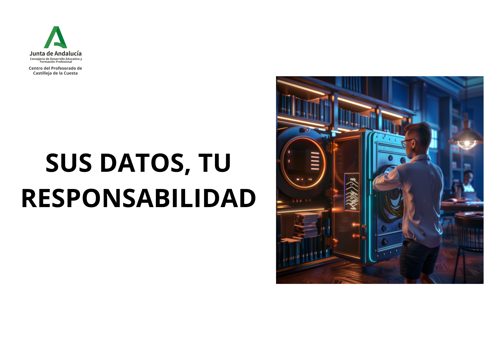

---

<!-- <h2 class="r-fit-text" style="text-align: center"> Sus datos, tu responsabilidad </h2>

--- -->

## Protección de datos: reinventando la rueda desde 1999

---

## Desmitificando la protección de datos

## No es solo burocracia... es protección

## ¿Alguna vez te has preguntado cuánto valen tus datos?

## Tras tus pasos digitales

## Actores clave en los riesgos de privacidad

* Corredores de datos<!-- .element: class="fragment" -->

* Gigantes tecnológicos (FAANG)<!-- .element: class="fragment" -->

Note:

Corredores de datos:

* Recopilan y venden información personal.
* Poca transparencia en sus prácticas.
* Datos comunes: nombre, dirección, historial de navegación.

Gigantes tecnológicos FAANG (Facebook, Amazon, Apple, Netflix, y Google):

* Acumulan grandes cantidades de datos de usuarios.
* Personalización de servicios y anuncios dirigidos.
* Preocupaciones sobre la privacidad y control de la información.

## Data Brokers y aplicaciones móviles

###

* **Permisos excesivos**. Muchas apps solicitan permisos innecesarios para su función (ej. agenda en apps de comida).

* **Rastreadores invisibles**. Incorporan rastreadores que monitorean actividad en segundo plano.
<!-- .element: class="fragment" -->

* **Casos reales**. Ejemplo: [Aplicación de McDonald's](https://reports.exodus-privacy.eu.org/es/reports/com.mcdo.mcdonalds/latest/).
<!-- .element: class="fragment" -->

###

* **Análisis propio**. Herramientas como [Exodus Privacy](https://play.google.com/store/apps/details?id=org.eu.exodus_privacy.exodusprivacy) permiten verificar permisos y rastreadores peligrosos.

* *"Lo que compartes en una app… puede acabar en manos de un broker de datos."*
<!-- .element: class="fragment" -->

### Bajo el hechizo de los gigantes

###  Google: ¿Privacidad o personalización?

* **Búsquedas y actividad web**: Cada búsqueda y visita crea un perfil detallado de intereses.
<!-- .element: class="fragment" -->

* **Anuncios dirigidos**. Datos personales = anuncios personalizados = ingresos publicitarios.
<!-- .element: class="fragment" -->

* **Dispositivos móviles**. Ubicación y actividad monitorizadas en dispositivos Android.
<!-- .element: class="fragment" -->

###

* **Historial de ubicaciones**: Google rastrea tus movimientos y los presenta en mapas interactivos.

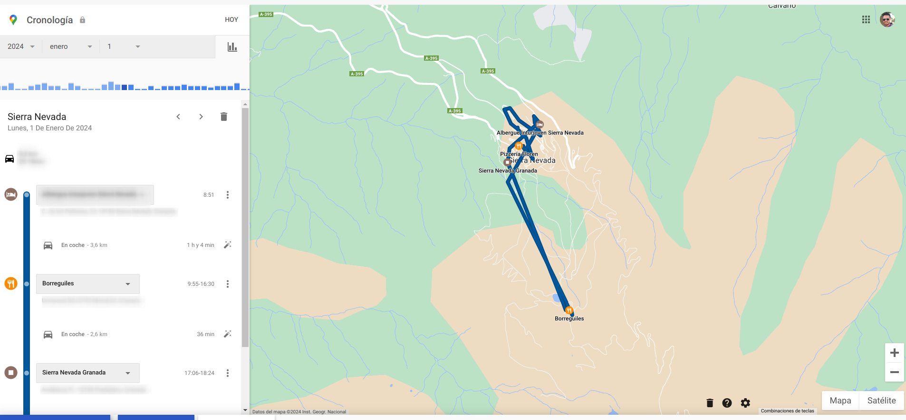

### 

* **Ingresos**. Publicidad = 77,4% de sus ingresos ($237.85 mil millones en 2023).

* *Google: El precio de la personalización es tu privacidad*<!-- .element: class="fragment" -->

## Si el servicio es gratuito, el producto eres tú.

---

## Don't panic!

---

## Nuestro objetivo...

---

### Según la AEPD...

> Dato de carácter personal no es solo el nombre y los apellidos de una persona, sino toda
información referida a esta o que pueda identificarla<!-- .element: class="fragment" -->

Note:
El nombre y apellidos de un alumno, de sus padres, su dirección, su número de teléfono o su correo electrónico son datos de carácter personal. También lo son las imágenes de los alumnos o, por ejemplo, la profesión, los estudios o el lugar donde trabajan los padres, o su número de cuenta bancaria.

---

### Reflexiona, sobre...

###
- ¿Dónde están los datos de mi alumnado?

- ¿Puedo usar cualquier aplicación libremente?<!-- .element: class="fragment" -->

- ¿Quién tiene la responsabilidad?<!-- .element: class="fragment" -->

###

- Si quiero comunicarme con mi alumnado... ¿Qué opciones tengo?

- ¿Necesito su permiso para utilizar información personal?<!-- .element: class="fragment" -->

- ¿Puedo realizar fotografías o vídeos sin consentimiento?<!-- .element: class="fragment" -->

---

## LOPDGDD en acción

---

### ¿Listos para aplicar la LOPDGDD en casos reales?

## Accesso a los materiales

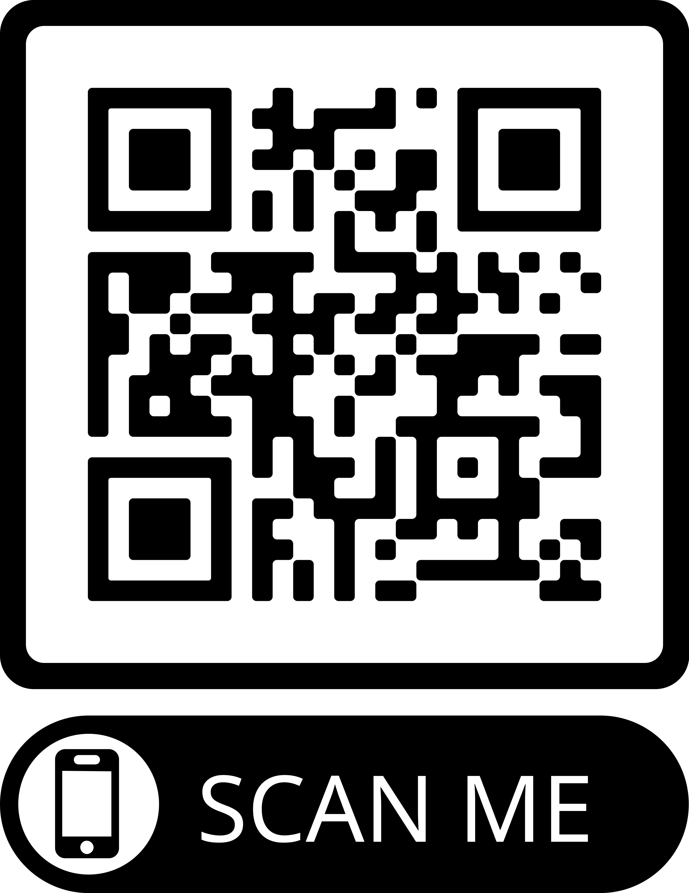

---

## Legitimación para el tratamiento de datos

### 
- El RGPD y la LOPDGDD establece en 14 años la edad límite para prestar el consentimiento.<!-- .element: class="fragment" -->

- Datos necesarios para la función educativa.<!-- .element: class="fragment" -->

- Ejemplos de legitimación.<!-- .element: class="fragment" -->

Note:
La ley de educación legitima a los centros a recabar datos de carácter personal para la función docente y orientadora de los alumnos en referencia a:
- El origen y ambiente familiar y social.
- Las características o condiciones personales.
- El desarrollo y resultados de su escolarización.
- Las circunstancias cuyo conocimiento sea necesario para educar y orientar a los alumnos.

### A tener en cuenta...
- Los datos personales no podrán usarse para fines diferentes al educativo (función docente y orientadora).<!-- .element: class="fragment" -->

- El personal que acceda a los datos personales está sometido al deber de guardar secreto art.5 LOPDGDD.<!-- .element: class="fragment" -->

### 
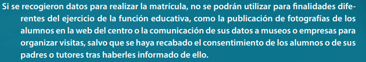

---

## Recogida de datos por los centros educativos

### 
- ¿Se pueden recabar datos sobre la situación familiar de los padres de los alumnos?
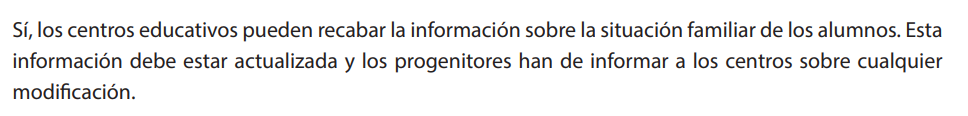<!-- .element: class="fragment" -->

###
- ¿Se pueden recabar datos de salud?
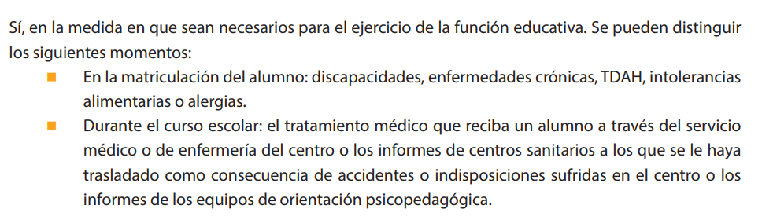<!-- .element: class="fragment" -->

###
- ¿Se pueden recabar datos biométricos?
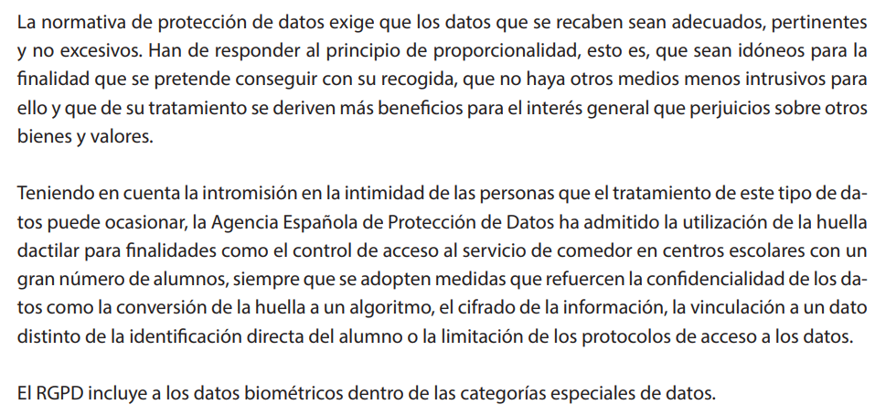<!-- .element: class="fragment" -->

### 
- ¿Se pueden recabar imágenes de los alumnos para el expediente académico?
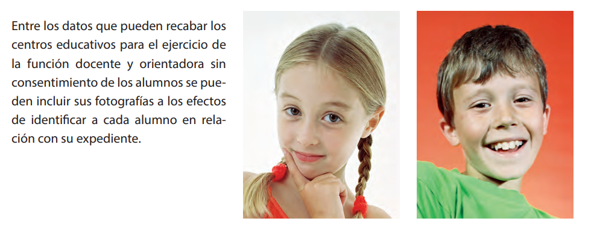<!-- .element: class="fragment" -->

###
- ¿Se pueden recabar datos para finalidades distintas de la función propiamente
educativa? 
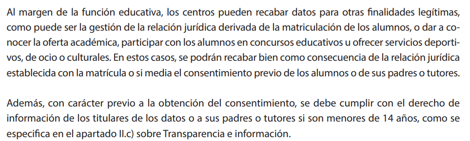<!-- .element: class="fragment" -->

### 
- ¿Puede un centro educativo acceder al contenido de dispositivos electrónicos de los alumnos, como los sistemas de mensajería instantánea (WhatsApp) o redes sociales?
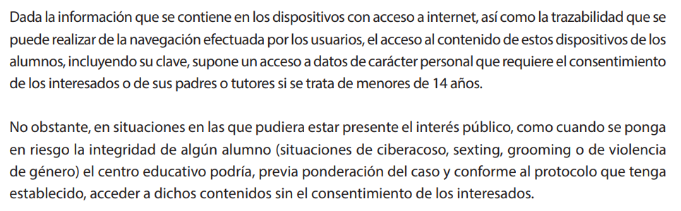<!-- .element: class="fragment" -->

---

## Tratamiento de los datos de los alumnos

###
- ¿Se pueden hacer públicas las calificaciones escolares?

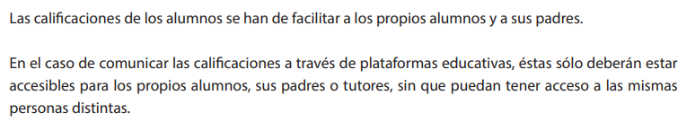<!-- .element: class="fragment" -->

###
- ¿Pueden los profesores facilitar las calificaciones oralmente en clase? 
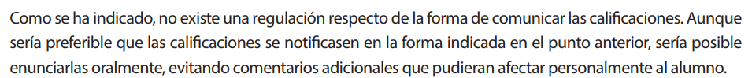<!-- .element: class="fragment" -->

###
- ¿Pueden los padres solicitar las calificaciones de sus hijos mayores de edad? 
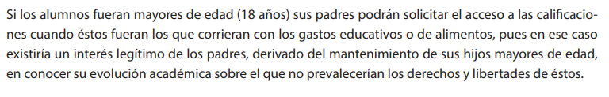<!-- .element: class="fragment" -->

### 
- ¿Pueden los padres acceder a la información sobre las ausencias escolares de
sus hijos si estos son mayores de edad?
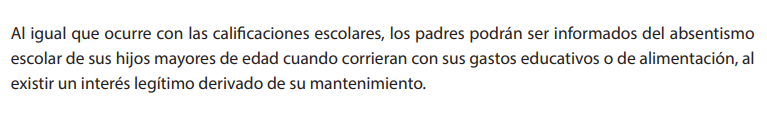<!-- .element: class="fragment" -->

### 
- Acceso a la información académica por padres separados 
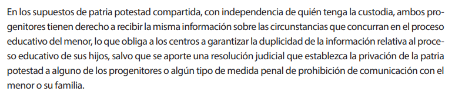<!-- .element: class="fragment" -->

###
- ¿Se pueden comunicar los datos a instituciones, entidades o empresas que van
a ser visitadas por los alumnos en una actividad extraescolar, por ejemplo, una
exposición, un museo, una fábrica o un club deportivo?
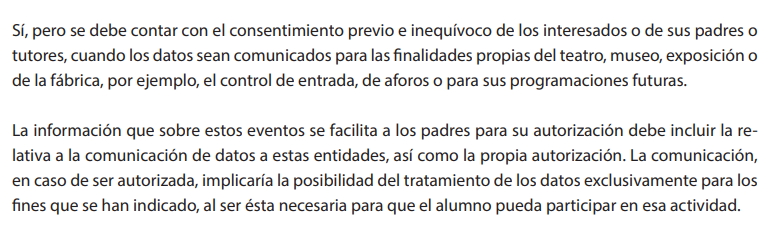<!-- .element: class="fragment" -->

###
- ¿Se pueden comunicar los datos a los Servicios Sanitarios autonómicos, o a un
ayuntamiento para campañas de vacunación o programas de salud escolar
(bucodental, alimentaria, etc.)? 
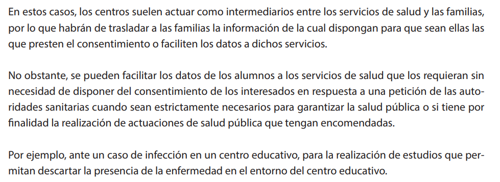<!-- .element: class="fragment" -->

---

## Tratamiento de las imágenes de los alumnos

### 
- ¿Pueden los centros educativos captar imágenes de los alumnos durante las
actividades escolares? 
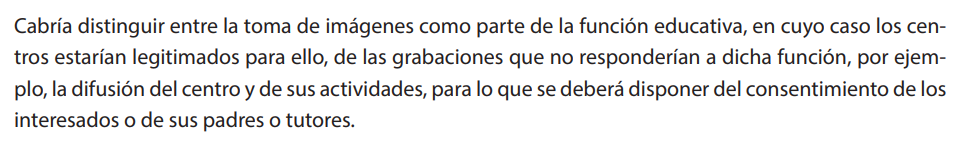<!-- .element: class="fragment" -->

### 
- ¿Puede un profesor grabar imágenes de los alumnos para una actividad escolar?
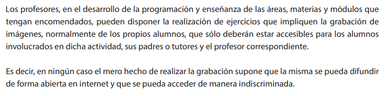<!-- .element: class="fragment" -->

### 
- ¿Pueden los familiares de los alumnos que participan en un evento abierto a las familias grabar imágenes del evento? 
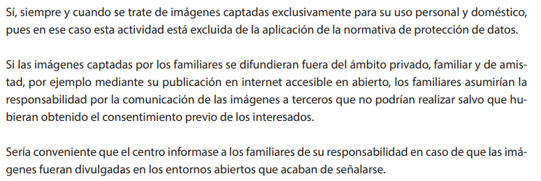<!-- .element: class="fragment" -->

### 
- Si unos padres se niegan a que se tomen imágenes de su hijo en un evento en
el centro educativo, ¿se ha de cancelar dicho evento?  
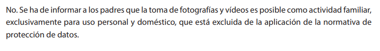<!-- .element: class="fragment" -->

### 
- ¿Pueden los centros escolares prohibir la toma de imágenes en sus
instalaciones?  
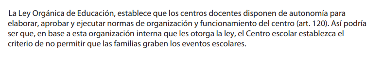<!-- .element: class="fragment" -->

---

## Tratamiento de datos en internet

###
- ¿Quién es el responsable del tratamiento de los datos personales de los
alumnos en las plataformas educativas? 
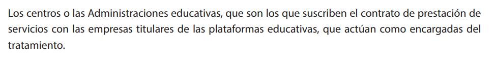<!-- .element: class="fragment" -->

### 
- ¿Estamos legitimados a usar cualquier plataforma educativa? 
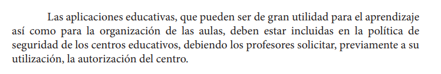<!-- .element: class="fragment" -->

### 
- ¿Se pueden publicar en la web del centro los datos de los profesores, tutores y otros responsables del centro? 
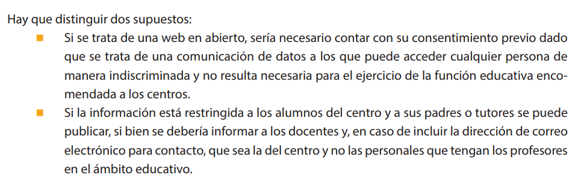<!-- .element: class="fragment" -->

###
- ¿Puede publicarse en la web del centro información relativa a los alumnos,
como fotografías o vídeos? 
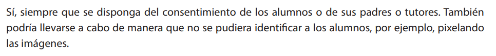<!-- .element: class="fragment" -->

### 
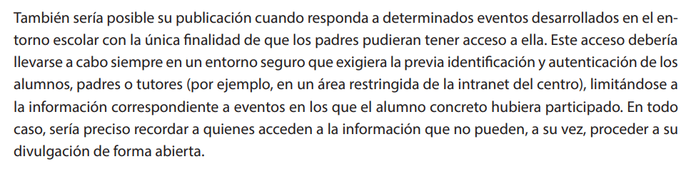<!-- .element: class="fragment" -->

###
- ¿Pueden publicarse datos personales de los alumnos en, ...?
  - La página web del centro educativo
  - El blog del centro ducativo 
  - Redes sociales

---

## Videovigilancia

###
- ¿Se pueden instalar cámaras de videovigilancia en todas las instalaciones
del colegio?
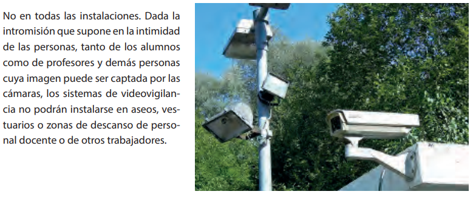<!-- .element: class="fragment" -->

###
- ¿Se pueden instalar cámaras de videovigilancia en las aulas alegando motivos
de conflictividad?
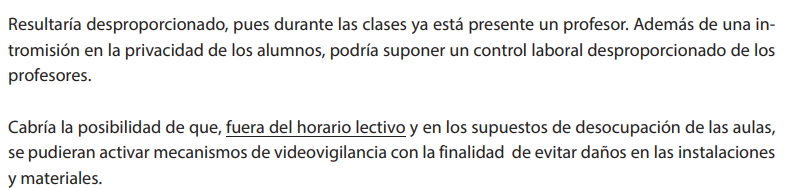<!-- .element: class="fragment" -->

###
- ¿Se pueden instalar cámaras de videovigilancia en los patios de recreo y
comedores?
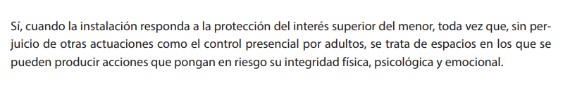<!-- .element: class="fragment" -->

###
- ¿Se debe informar de la existencia de un sistema de videovigilancia?
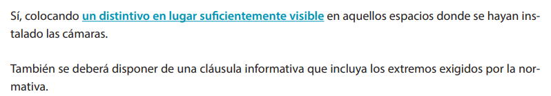<!-- .element: class="fragment" -->

---

## Decálogo

### 
- Necesitamos sus datos personales
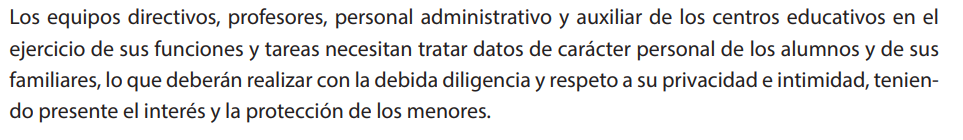

### 
- Estamos legitimados
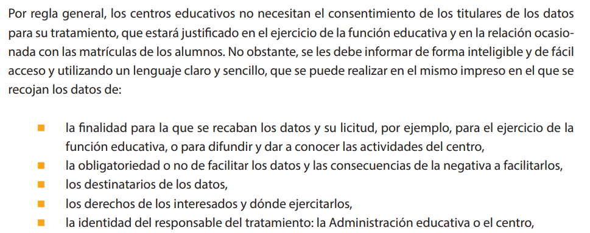

### 
- Con responsabilidad
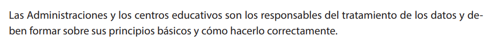

### 
- Informando de cada acción

### 
- Pediendo permiso para el uso de Apps
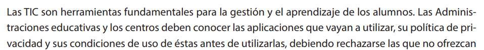

### 
- El centro debe disponer de una guía

### 
- Comunicaciones por canales oficiales
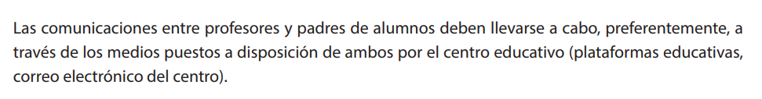

### 
- No se recomienda el uso de whatsapp

### 
- Grabar si, difudir No

### 
- ¿Evento escolar? Avisemos a las familias de la NO difusión.

---

## ¡Objetivo cumplido!

---

<!-- .slide: data-background-video="assets/searching.mp4" data-background-opacity="0.6" data-background-video-loop data-background-video-muted-->

## ¡Gracias por haberme dedicado vuestro tiempo!

---

## Contacto

 Manuel J. Rivas Sández 
 <small>
- **Email:** [xmrivas@proton.me](mailto:xmrivas@proton.me)
- **Telegram:** [@xmrivas](https://t.me/xmrivas)
- **Twitter:** [@0xmrivas](https://twitter.com/0xmrivas)

- 💼 **PES SAI en el IES Rafael Alerti**

🛡️ Amante del **Hacking Etico** y la **Seguridad Informática**
</small> 

---

## ¡ Escanea, y Opina !

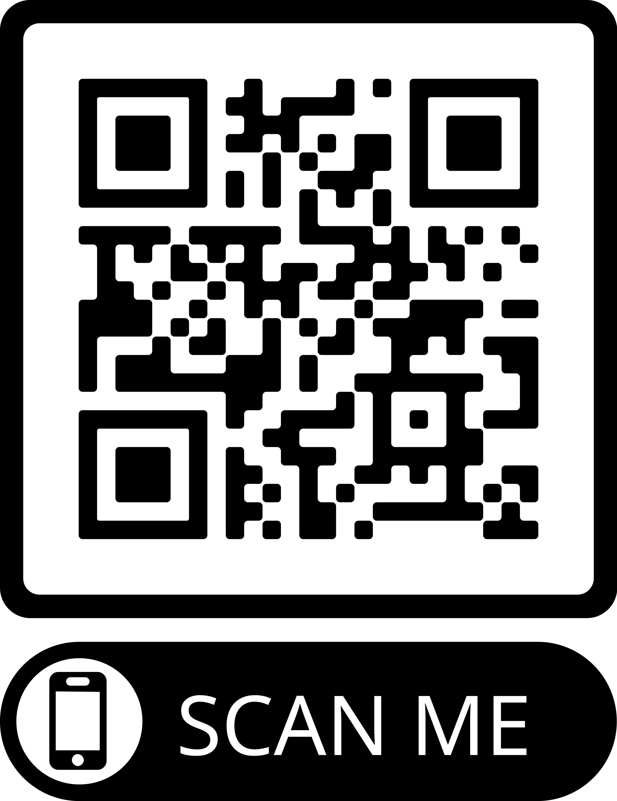

