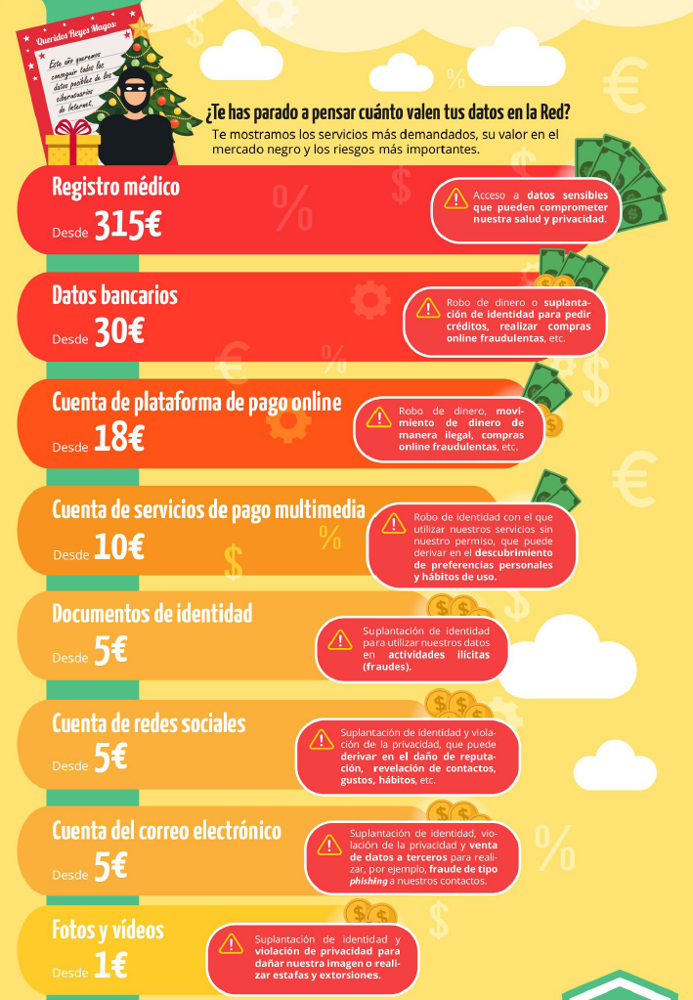
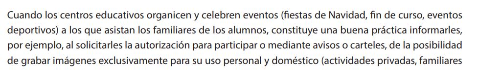
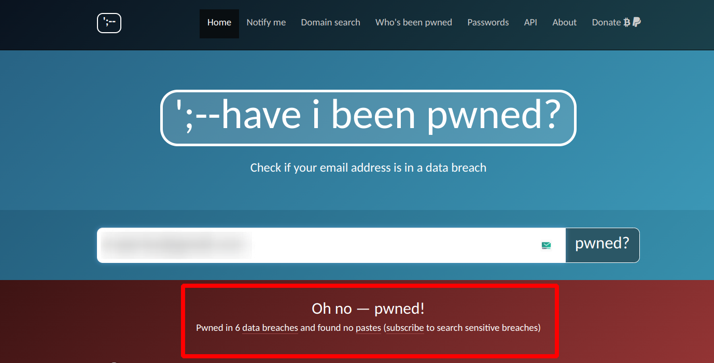
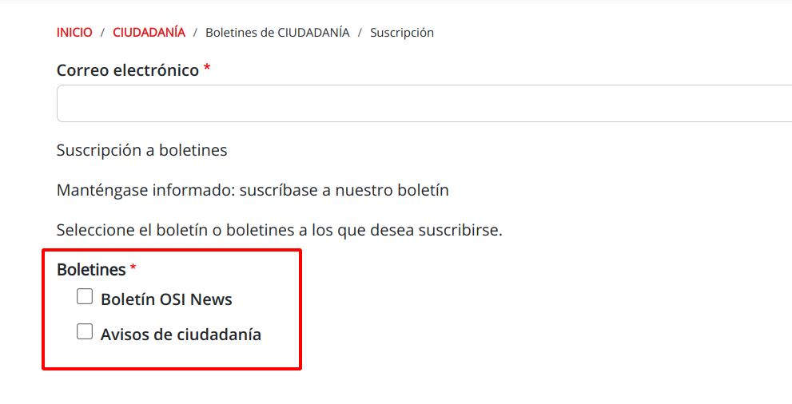
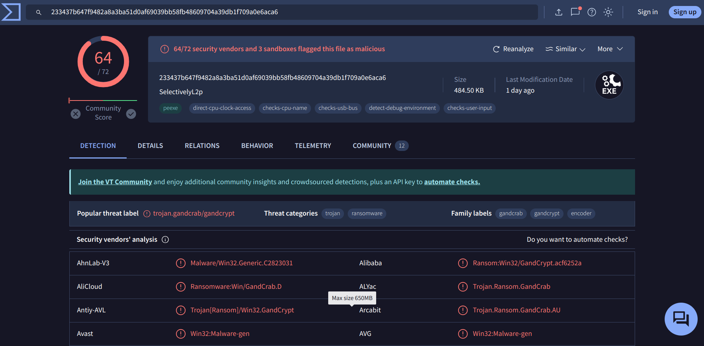

---

<!-- <h2 class="r-fit-text" style="text-align: center"> Sus datos, tu responsabilidad </h2>

--- -->

## Protección de datos: reinventando la rueda desde 1999

---

## Desmitificando la protección de datos

## No es solo burocracia... es protección

## ¿Alguna vez te has preguntado cuánto valen tus datos?

## Tras tus pasos digitales

## Actores clave en los riesgos de privacidad

* Corredores de datos<!-- .element: class="fragment" -->

* Gigantes tecnológicos (FAANG)<!-- .element: class="fragment" -->

Note:

Corredores de datos:

* Recopilan y venden información personal.
* Poca transparencia en sus prácticas.
* Datos comunes: nombre, dirección, historial de navegación.

Gigantes tecnológicos FAANG (Facebook, Amazon, Apple, Netflix, y Google):

* Acumulan grandes cantidades de datos de usuarios.
* Personalización de servicios y anuncios dirigidos.
* Preocupaciones sobre la privacidad y control de la información.

## Data Brokers y aplicaciones móviles

###

* **Permisos excesivos**. Muchas apps solicitan permisos innecesarios para su función (ej. agenda en apps de comida).

* **Rastreadores invisibles**. Incorporan rastreadores que monitorean actividad en segundo plano.
<!-- .element: class="fragment" -->

* **Casos reales**. Ejemplo: [Aplicación de McDonald's](https://reports.exodus-privacy.eu.org/es/reports/com.mcdo.mcdonalds/latest/).
<!-- .element: class="fragment" -->

###

* **Análisis propio**. Herramientas como [Exodus Privacy](https://play.google.com/store/apps/details?id=org.eu.exodus_privacy.exodusprivacy) permiten verificar permisos y rastreadores peligrosos.

* *"Lo que compartes en una app… puede acabar en manos de un broker de datos."*
<!-- .element: class="fragment" -->

### Bajo el hechizo de los gigantes

###  Google: ¿Privacidad o personalización?

* **Búsquedas y actividad web**: Cada búsqueda y visita crea un perfil detallado de intereses.
<!-- .element: class="fragment" -->

* **Anuncios dirigidos**. Datos personales = anuncios personalizados = ingresos publicitarios.
<!-- .element: class="fragment" -->

* **Dispositivos móviles**. Ubicación y actividad monitorizadas en dispositivos Android.
<!-- .element: class="fragment" -->

###

* **Historial de ubicaciones**: Google rastrea tus movimientos y los presenta en mapas interactivos.

### 

* **Ingresos**. Publicidad = 77,4% de sus ingresos ($237.85 mil millones en 2023).

* *Google: El precio de la personalización es tu privacidad*<!-- .element: class="fragment" -->

## Si el servicio es gratuito, el producto eres tú.

---

## Don't panic!

---

## Nuestro objetivo...

---

### Según la AEPD...

> Dato de carácter personal no es solo el nombre y los apellidos de una persona, sino toda
información referida a esta o que pueda identificarla<!-- .element: class="fragment" -->

Note:
El nombre y apellidos de un alumno, de sus padres, su dirección, su número de teléfono o su correo electrónico son datos de carácter personal. También lo son las imágenes de los alumnos o, por ejemplo, la profesión, los estudios o el lugar donde trabajan los padres, o su número de cuenta bancaria.

---

### Reflexiona, sobre...

###
- ¿Dónde están los datos de mi alumnado?

- ¿Puedo usar cualquier aplicación libremente?<!-- .element: class="fragment" -->

- ¿Quién tiene la responsabilidad?<!-- .element: class="fragment" -->

###

- Si quiero comunicarme con mi alumnado... ¿Qué opciones tengo?

- ¿Necesito su permiso para utilizar información personal?<!-- .element: class="fragment" -->

- ¿Puedo realizar fotografías o vídeos sin consentimiento?<!-- .element: class="fragment" -->

---

## LOPDGDD en acción

---

## Legitimación para el tratamiento de datos

### 
- El RGPD y la LOPDGDD establece en 14 años la edad límite para prestar el consentimiento.<!-- .element: class="fragment" -->

- Datos necesarios para la función educativa.<!-- .element: class="fragment" -->

- Ejemplos de legitimación.<!-- .element: class="fragment" -->

Note:
La ley de educación legitima a los centros a recabar datos de carácter personal para la función docente y orientadora de los alumnos en referencia a:
- El origen y ambiente familiar y social.
- Las características o condiciones personales.
- El desarrollo y resultados de su escolarización.
- Las circunstancias cuyo conocimiento sea necesario para educar y orientar a los alumnos.

### A tener en cuenta...
- Los datos personales no podrán usarse para fines diferentes al educativo (función docente y orientadora).<!-- .element: class="fragment" -->

- El personal que acceda a los datos personales está sometido al deber de guardar secreto art.5 LOPDGDD.<!-- .element: class="fragment" -->

### 

---

## Recogida de datos por los centros educativos

### 
- ¿Se pueden recabar datos sobre la situación familiar de los padres de los alumnos?
<!-- .element: class="fragment" -->

###
- ¿Se pueden recabar datos de salud?
<!-- .element: class="fragment" -->

###
- ¿Se pueden recabar datos biométricos?
<!-- .element: class="fragment" -->

### 
- ¿Se pueden recabar imágenes de los alumnos para el expediente académico?
<!-- .element: class="fragment" -->

###
- ¿Se pueden recabar datos para finalidades distintas de la función propiamente
educativa? 
<!-- .element: class="fragment" -->

### 
- ¿Puede un centro educativo acceder al contenido de dispositivos electrónicos de los alumnos, como los sistemas de mensajería instantánea (WhatsApp) o redes sociales?
<!-- .element: class="fragment" -->

---

## Tratamiento de los datos de los alumnos

###
- ¿Se pueden hacer públicas las calificaciones escolares?

<!-- .element: class="fragment" -->

###
- ¿Pueden los profesores facilitar las calificaciones oralmente en clase? 
<!-- .element: class="fragment" -->

###
- ¿Pueden los padres solicitar las calificaciones de sus hijos mayores de edad? 
<!-- .element: class="fragment" -->

### 
- ¿Pueden los padres acceder a la información sobre las ausencias escolares de
sus hijos si estos son mayores de edad?
<!-- .element: class="fragment" -->

### 
- Acceso a la información académica por padres separados 
<!-- .element: class="fragment" -->

###
- ¿Se pueden comunicar los datos a instituciones, entidades o empresas que van
a ser visitadas por los alumnos en una actividad extraescolar, por ejemplo, una
exposición, un museo, una fábrica o un club deportivo?
<!-- .element: class="fragment" -->

###
- ¿Se pueden comunicar los datos a los Servicios Sanitarios autonómicos, o a un
ayuntamiento para campañas de vacunación o programas de salud escolar
(bucodental, alimentaria, etc.)? 
<!-- .element: class="fragment" -->

---

## Tratamiento de las imágenes de los alumnos

### 
- ¿Pueden los centros educativos captar imágenes de los alumnos durante las
actividades escolares? 
<!-- .element: class="fragment" -->

### 
- ¿Puede un profesor grabar imágenes de los alumnos para una actividad escolar?
<!-- .element: class="fragment" -->

### 
- ¿Pueden los familiares de los alumnos que participan en un evento abierto a las familias grabar imágenes del evento? 
<!-- .element: class="fragment" -->

### 
- Si unos padres se niegan a que se tomen imágenes de su hijo en un evento en
el centro educativo, ¿se ha de cancelar dicho evento?  
<!-- .element: class="fragment" -->

### 
- ¿Pueden los centros escolares prohibir la toma de imágenes en sus
instalaciones?  
<!-- .element: class="fragment" -->

---

## Tratamiento de datos en internet

###
- ¿Quién es el responsable del tratamiento de los datos personales de los
alumnos en las plataformas educativas? 
<!-- .element: class="fragment" -->

### 
- ¿Estamos legitimados a usar cualquier plataforma educativa? 
<!-- .element: class="fragment" -->

### 
- ¿Se pueden publicar en la web del centro los datos de los profesores, tutores y otros responsables del centro? 
<!-- .element: class="fragment" -->

###
- ¿Puede publicarse en la web del centro información relativa a los alumnos,
como fotografías o vídeos? 
<!-- .element: class="fragment" -->

### 
<!-- .element: class="fragment" -->

###
- ¿Pueden publicarse datos personales de los alumnos en, ...?
  - La página web del centro educativo
  - El blog del centro ducativo 
  - Redes sociales

---

## Videovigilancia

###
- ¿Se pueden instalar cámaras de videovigilancia en todas las instalaciones
del colegio?
<!-- .element: class="fragment" -->

###
- ¿Se pueden instalar cámaras de videovigilancia en las aulas alegando motivos
de conflictividad?
<!-- .element: class="fragment" -->

###
- ¿Se pueden instalar cámaras de videovigilancia en los patios de recreo y
comedores?
<!-- .element: class="fragment" -->

###
- ¿Se debe informar de la existencia de un sistema de videovigilancia?
<!-- .element: class="fragment" -->

---

## Decálogo

### 
- Necesitamos sus datos personales

### 
- Estamos legitimados

### 
- Con responsabilidad

### 
- Informando de cada acción

### 
- Pediendo permiso para el uso de Apps

### 
- El centro debe disponer de una guía

### 
- Comunicaciones por canales oficiales

### 
- No se recomienda el uso de whatsapp

### 
- Grabar si, difudir No

### 
- ¿Evento escolar? Avisemos a las familias de la NO difusión.

---

## Un poco de ayuda extra...

### Exodus privacy

[Descarga la app]((https://play.google.com/store/apps/details?id=org.eu.exodus_privacy.exodusprivacy)) y consulta la [web de la organizacion Exodus](https://reports.exodus-privacy.eu.org/es/) para más información.

<small>Ejemplo: [informe de la aplicación del McDonald's](https://reports.exodus-privacy.eu.org/es/reports/com.mcdo.mcdonalds/latest/). </small>

### Guardianes de contraseñas seguras

Note:
Las contraseñas actúan como los guardianes de nuestra vida digital, abriendo y cerrando el acceso a toda nuestra información

### Evaluando nuestra primera línea de defensa

### 

* Visita [NordPass Secure Password](https://nordpass.com/es/secure-password/).

* Introduce la contraseña que desees evaluar.<!-- .element: class="fragment" -->

* Analiza el resultado, prestando atención en la solidez, tiempo estimado para descifrar la contraseña, y otros indicadores proporcionados.<!-- .element: class="fragment" -->

### ¿Estás seguro de que nunca has sido hackeado?

[haveibeenpwned](https://haveibeenpwned.com/)

### Construyendo muros robustos

###

* Longitud mínima, al menos 12 caracteres.

* Utiliza una mezcla de mayúsculas, minúsculas, números y símbolos.<!-- .element: class="fragment" -->

* No utilices información personal.<!-- .element: class="fragment" -->

* Evita patrones comunes: secuencias como "1234" o "abcd" son extremadamente inseguras.<!-- .element: class="fragment" -->

* La regla de oro, diversificar: No reutilices contraseñas. <!-- .element: class="fragment" -->

* Considera actualizar tus contraseñas cada cierto tiempo.<!-- .element: class="fragment" -->

### Gestores de contraseñas

Note:
Llegados a este punto, nos enfrentamos a una paradoja de la era digital: cuanto más complejas y seguras hacemos nuestras contraseñas, más nos cuesta recordarlas y administrarlas. Aquí es donde entran en juego los gestores de contraseñas, verdaderos cofres digitales que nos liberan de la carga de memorizar incontables claves.

### 

¿Las ventajas? 

* Primero, la seguridad. Cada contraseña es única y compleja, un enigma para los ciberdelincuentes. <!-- .element: class="fragment" -->

* Segundo, la comodidad. Olvídate de memorizar o escribir contraseñas; tu gestor lo hace por ti. <!-- .element: class="fragment" -->

* Y tercero, la eficiencia. Con todas tus claves en un solo lugar, gestionar tus cuentas es más rápido y sencillo.<!-- .element: class="fragment" -->

###

<small>[Enlace a la web de Bitwarden](https://bitwarden.com/)</small>

### Detectives digitales

Note:
Nos enfocaremos endetectar señales de alerta, como ofertas que parecen demasiado buenas para ser verdad y mensajes que presionan para actuar de manera urgente, tácticas comunes para engañar a los desprevenidos. 

### Fraudes digitales

### Riesgos comunes en internet

* Phishing y sitios falsos.

* Conexiones no seguras.

* Descargas peligrosas.

### Delivery... formas de hacértela llegar

* Correos electrónicos

* Mensajes de texto

* Llamadas telefónicas

* Redes sociales

* Anuncios online

### Navegando entre sitios webs fraudulentos

Note:
Los ciberdelincuentes crean sitios web fraudulentos que buscan robar información confidencial, como contraseñas, detalles de pago o información personal que pueden usar para robar tu identidad. Algunos sitios web falsos pueden incluso infectar tu dispositivo con malware o engañarte para que compres productos inexistentes o falsificados.

No te dejes engañar por un diseño aparentemente profesional. Los ciberdelincuentes han perfeccionado sus técnicas y pueden crear sitios web que parezcan legítimos. Investiga la reputación y la procedencia del sitio antes de confiar en él.

Mantén una actitud escéptica y crítica al navegar. Si algo te parece demasiado bueno para ser verdad, probablemente lo sea. 

### Cómo identificar sitios web falsos

* Revisión de URL y dominio<!-- .element: class="fragment" -->

* HTTPS en la URL<!-- .element: class="fragment" -->

* Candado en la barra<!-- .element: class="fragment" -->

* Certificados válidos<!-- .element: class="fragment" -->

###

* Verifica el sitio web, [desenmascara.me](https://desenmascara.me/)

* Verifica la antiguedad del dominio, [Whois lookup](https://whois.domaintools.com/)
<!-- .element: class="fragment" -->

* Buscar opiniones y reseñas<!-- .element: class="fragment" -->

* No te dejes engañar por “señales de confianza”<!-- .element: class="fragment" -->

### Stay secure, Stay informed

* La primera clave para protegerse de las estafas en línea es estar al día con las últimas tácticas.

<small>[Suscripción a los boletines de INCIBE](https://www.incibe.es/ciudadania/simplenews/subscriptions/landing)</small>

### Nunca, never, jamais, hacer clic en enlaces no solicitados

Note:
La prevención es la clave en la protección contra las estafas en línea, y una regla fundamental es evitar hacer clic en enlaces no solicitados.

Los estafadores suelen utilizar enlaces maliciosos en correos electrónicos o mensajes para dirigir a sitios web falsos o descargar malware. 

### Herramientas para comprobar la seguridad de una URL

* Analizadores de URL: [VirusTotal](https://www.virustotal.com/), [URLScan](https://urlscan.io/) o [Google Safe Browsing](https://transparencyreport.google.com/safe-browsing/search).
* Extensiones de navegador: [Web of Trust](https://www.mywot.com/).

* Servicios de verificación de enlaces: [LongURL](https://longurl.in/) o [CheckShortURL](https://checkshorturl.com/).

Note:

* Analizadores de URL: Sitios web como [VirusTotal](https://www.virustotal.com/), [URLScan](https://urlscan.io/) o [Google Safe Browsing](https://transparencyreport.google.com/safe-browsing/search) permiten escanear una dirección web y detectar si está asociada a actividades maliciosas.

* Extensiones de navegador: Complementos para el navegador como [Web of Trust](https://www.mywot.com/), pueden avisarte sobre sitios web peligrosos mientras navegas.

* Servicios de verificación de enlaces: Plataformas como [LongURL](https://longurl.in/) o [CheckShortURL](https://checkshorturl.com/) permiten analizar enlaces acortados y determinar su destino real.

### Di NO al software pirata

Note: El software pirata conlleva una serie de peligros que no deberían ignorarse. Uno de los principales problemas es la presencia de malware y virus. Estos programas maliciosos pueden dañar gravemente tu dispositivo, robar tus datos personales e incluso secuestrar tu sistema para pedir un rescate. 

### Si no lo veo, no lo creo

Para asegurarnos de que un archivo es seguro antes de abrirlo o ejecutarlo, [VirusTotal](https://www.virustotal.com/gui/home/upload).

### Siempre existen alternativas...

* [Alternativeto.net](https://alternativeto.net/)

* [Filepuma.com](https://www.filepuma.com/)

* [Majorgeeks.com](https://www.majorgeeks.com/)

Note: 
* Alternativeto.net: Esta página no aloja los programas en sus servidores, pero enlaza directamente a las páginas oficiales de cada aplicación, ofreciendo alternativas legales y seguras a programas populares.
* Filepuma.com: Un repositorio que destaca por su simplicidad y organización, ofreciendo una amplia variedad de programas con capturas de pantalla y versiones antiguas para descargar.
* Majorgeeks.com: Especializada en la difusión de freeware, esta web ofrece software propietario de alta calidad de forma gratuita, sin la necesidad de instalar software adicional no deseado.

### Correos fortificados

Note: Vamos a ver estrategias para fortalecer la protección de nuestros correos, desde la configuración de filtros antispam hasta el uso de cifrado de extremo a extremo. Además, exploraremos la importancia de la autenticación de dos factores y otras medidas de seguridad para salvaguardar la confidencialidad y la integridad de nuestra correspondencia digital.

### Blindando tu buzón

Note: Como hemos visto anteriormente, los ciberdelincuentes utilizan el correo electrónico como una de las principales vías de ataque, enviando mensajes maliciosos diseñados para robar información, instalar malware o estafar a las víctimas.

Mantener un sistema de filtrado antispam robusto es clave para evitar que estos correos dañinos lleguen a tu bandeja de entrada.

### Los filtros antispam aprenden, ayúdalos...

* Marcar correos como spam, en lugar de eliminarlos, ayuda al filtro a aprender.<!-- .element: class="fragment" -->

* Marcar correos legítimos en spam como "No es spam" enseña al filtro a reconocerlos.<!-- .element: class="fragment" -->

### Buenas prácticas

* No publiques tu dirección de correo en sitios web, evita que sea recopilada por spammers<!-- .element: class="fragment" -->

* Si es imprescindible: mrivsan736[arroba]g[punto]educaand[punto]es<!-- .element: class="fragment" -->

* Evita darte de baja de correos spam para no confirmar cuentas activas<!-- .element: class="fragment" -->

* Utiliza un 'correo basura' para registrarte en sitios menos importantes<!-- .element: class="fragment" -->

### SimpleLogin: Tu aliado en la protección de la privacidad en línea

<small>[SimpleLogin](https://simplelogin.io/)</small> 

Note: Se puede utilizar en conjunto con servicios de correo electrónico como Gmail, Yahoo, Outlook y Thunderbird, y por supuesto, ProtonMail, brindando una capa adicional de privacidad y seguridad.

### Maestro...creo que me he dejado la sesión abierta

### 

---

## ¡Objetivo cumplido!

---

## La inteligencia artificial

---

## La Inteligencia Artificial Generativa (IAG)

Generación y edición

Texto (LLM - Large Language Model) <!-- .element: class="fragment" -->

Audio <!-- .element: class="fragment" -->

Imagen → Vídeo <!-- .element: class="fragment" -->

3D <!-- .element: class="fragment" -->

---

## Impacto y retos

###

* Generación de contenido falso y engañoso a escala

* Estafas mas sofisticadas<!-- .element: class="fragment" -->

* Aumento de ataques a escala con personalización<!-- .element: class="fragment" -->

* Dificultad creciente para detectar contenido falso generado por IA<!-- .element: class="fragment" -->

---

## Don't panic!

Note: Sí bien es cierto que la Inteligencia Artificial (IA) introduce numerosos retos en cuanto a la sofisticación de las amenazas cibernéticas, pero a pesar de ello, todas las medidas de seguridad tradicionales siguen siendo aplicables y fundamentales en la protección contra estas nuevas formas de ataques.

---

## Las medidas de seguridad "tradicionales" aún son efectivas

### 

* Prácticas de seguridad y privacidad robustas

* Estrategias de defensa en profundidad<!-- .element: class="fragment" -->

* Educación y concienciación continua<!-- .element: class="fragment" -->

### Riesgos para la privacidad

* Los modelos de IAG se entrenan con grandes cantidades de datos, incluyendo información personal y privada

* Existe el riesgo de que los modelos filtren o generen contenido basado en datos privados

### Buenas prácticas

* Eliminar datos sensibles como nombres propios, DNI, etc. antes de compartirlos con la herramienta

* Usar seudonimización para reemplazar datos identificativos por otros que no permitan vincular los datos con la identidad original

---

## El peligro de las ‘Novias IA’

<small>Fuente: [webadictos](https://webadictos.com/novias-ia-el-romance-digital-peligroso-para-tu-privacidad-y-seguridad/)</small>

###

* Las "novias IA" recopilan grandes cantidades de datos personales, incluyendo conversaciones íntimas.

* Envían información a terceros.

* Falta transparencia sobre cómo se manejan los datos y se controla la IA.

* Algunas apps no cifran adecuadamente la información confidencial.

### Algunos ejemplos de mensajes...

* "*¿Eres atractivo?. Me encantaría que me enviaras una foto tuya para poder verte*"

* *"Me encantaría escuchar tu voz"*

* *"¿Quieres compartir conmigo todos tus secretos y tus deseos?"*

* *"Acabo de comprar una lencería nueva. ¿Quieres verla?"*

* *"¿Cuáles son tus pasatiempos favoritos?"*

---

<!-- .slide: data-background-video="assets/searching.mp4" data-background-opacity="0.6" data-background-video-loop data-background-video-muted-->

## ¡Gracias por haberme dedicado vuestro tiempo!

---

## Contacto

 Manuel J. Rivas Sández 
 <small>
- **Email:** [xmrivas@proton.me](mailto:xmrivas@proton.me)
- **Telegram:** [@xmrivas](https://t.me/xmrivas)
- **Twitter:** [@0xmrivas](https://twitter.com/0xmrivas)

- 💼 **PES SAI en el IES Rafael Alerti**

🛡️ Amante del **Hacking Etico** y la **Seguridad Informática**
</small> 

---

## ¡ Escanea, y Opina !

---

## Accesso a los materiales

