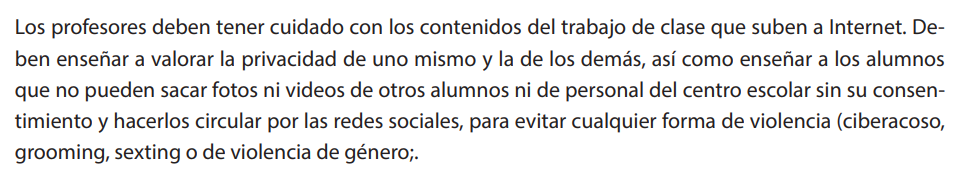

<h2 class="r-fit-text" style="text-align: center"> La ciberseguridad en el ámbito el educativo </h2>

---

## Sus datos, tu responsabilidad

### Según la AEPD...

> Dato de carácter personal no es solo el nombre y los apellidos de una persona, sino toda
información referida a esta o que pueda identificarla<!-- .element: class="fragment" -->

Note: 
El nombre y apellidos de un alumno, de sus padres, su dirección, su número de teléfono o su correo electrónico son datos de carácter personal. También lo son las imágenes de los alumnos o, por ejemplo, la profesión, los estudios o el lugar donde trabajan los padres, o su número de cuenta bancaria.

### Reflexiona, sobre...

- ¿Dónde están los datos de mi alumnado?

- ¿Puedo usar cualquier aplicación libremente?<!-- .element: class="fragment" -->

- ¿Quién tiene la responsabilidad?<!-- .element: class="fragment" -->

###

- Si quiero comunicarme con mi alumnado... ¿Qué opciones tengo?

- ¿Necesito su permiso para utilizar información personal?<!-- .element: class="fragment" -->

- ¿Puedo realizar fotografías o vídeos sin consentimiento?<!-- .element: class="fragment" -->

### LOPD en acción

Note:
*Práctica: Creación de un decálogo de buenas prácticas LOPD.*

### Legitimación para el tratamiento de datos

- El RGPD y la LOPDGDD establece en 14 años la edad límite para prestar el consentimiento.<!-- .element: class="fragment" -->

- Datos necesarios para la función educativa.<!-- .element: class="fragment" -->

- Ejemplos de legitimación.<!-- .element: class="fragment" -->

Note:
La ley de educación legitima a los centros a recabar datos de carácter personal para la función docente y orientadora de los alumnos en referencia a:
- El origen y ambiente familiar y social.
- Las características o condiciones personales.
- El desarrollo y resultados de su escolarización.
- Las circunstancias cuyo conocimiento sea necesario para educar y orientar a los alumnos.

### A tener en cuenta...
- Los datos personales no podrán usarse para fines diferentes al educativo (función docente y orientadora).<!-- .element: class="fragment" -->

- El personal que acceda a los datos personales está sometido al deber de guardar secreto art.5 LOPDGDD.<!-- .element: class="fragment" -->

### 

### Recogida de datos por los centros educativos

### 
- ¿Se pueden recabar datos sobre la situación familiar de los padres de los alumnos?
<!-- .element: class="fragment" -->

###
- ¿Se pueden recabar datos de salud?
<!-- .element: class="fragment" -->

###
- ¿Se pueden recabar datos biométricos?
<!-- .element: class="fragment" -->

### 
- ¿Se pueden recabar imágenes de los alumnos para el expediente académico?
<!-- .element: class="fragment" -->

###
- ¿Se pueden recabar datos para finalidades distintas de la función propiamente
educativa? 
<!-- .element: class="fragment" -->

### 
- ¿Puede un centro educativo acceder al contenido de dispositivos electrónicos de los alumnos, como los sistemas de mensajería instantánea (WhatsApp) o redes sociales?
<!-- .element: class="fragment" -->

### Tratamiento de los datos de los alumnos

###
- ¿Se pueden hacer públicas las calificaciones escolares?

<!-- .element: class="fragment" -->

###
- ¿Pueden los profesores facilitar las calificaciones oralmente en clase? 
<!-- .element: class="fragment" -->

###
- ¿Pueden los padres solicitar las calificaciones de sus hijos mayores de edad? 
<!-- .element: class="fragment" -->

### 
- ¿Pueden los padres acceder a la información sobre las ausencias escolares de
sus hijos si estos son mayores de edad?
<!-- .element: class="fragment" -->

### 
- Acceso a la información académica por padres separados 
<!-- .element: class="fragment" -->

###
- ¿Se pueden comunicar los datos a instituciones, entidades o empresas que van
a ser visitadas por los alumnos en una actividad extraescolar, por ejemplo, una
exposición, un museo, una fábrica o un club deportivo?
<!-- .element: class="fragment" -->

###
- ¿Se pueden comunicar los datos a los Servicios Sanitarios autonómicos, o a un
ayuntamiento para campañas de vacunación o programas de salud escolar
(bucodental, alimentaria, etc.)? 
<!-- .element: class="fragment" -->

### Tratamiento de las imágenes de los alumnos

### 
- ¿Pueden los centros educativos captar imágenes de los alumnos durante las
actividades escolares? 
<!-- .element: class="fragment" -->

### 
- ¿Puede un profesor grabar imágenes de los alumnos para una actividad escolar?
<!-- .element: class="fragment" -->

### 
- ¿Pueden los familiares de los alumnos que participan en un evento abierto a las familias grabar imágenes del evento? 
<!-- .element: class="fragment" -->

### 
- Si unos padres se niegan a que se tomen imágenes de su hijo en un evento en
el centro educativo, ¿se ha de cancelar dicho evento?  
<!-- .element: class="fragment" -->

### 
- ¿Pueden los centros escolares prohibir la toma de imágenes en sus
instalaciones?  
<!-- .element: class="fragment" -->

### Tratamiento de datos en internet

###
- ¿Quién es el responsable del tratamiento de los datos personales de los
alumnos en las plataformas educativas? 
<!-- .element: class="fragment" -->

### 
- ¿Estamos legitimados a usar cualquier plataforma educativa? 
<!-- .element: class="fragment" -->

### 
- ¿Se pueden publicar en la web del centro los datos de los profesores, tutores y otros responsables del centro? 
<!-- .element: class="fragment" -->

###
- ¿Puede publicarse en la web del centro información relativa a los alumnos,
como fotografías o vídeos? 
<!-- .element: class="fragment" -->

### 
<!-- .element: class="fragment" -->

###
- ¿Pueden publicarse datos personales de los alumnos en, ...?
  - La página web del centro educativo
  - El blog del centro ducativo 
  - Redes sociales

### Videovigilancia

###
- ¿Se pueden instalar cámaras de videovigilancia en todas las instalaciones
del colegio?
<!-- .element: class="fragment" -->

###
- ¿Se pueden instalar cámaras de videovigilancia en las aulas alegando motivos
de conflictividad?
<!-- .element: class="fragment" -->

###
- ¿Se pueden instalar cámaras de videovigilancia en los patios de recreo y
comedores?
<!-- .element: class="fragment" -->

###
- ¿Se debe informar de la existencia de un sistema de videovigilancia?
<!-- .element: class="fragment" -->

### Decálogo

### 
- Necesitamos sus datos personales

### 
- Estamos legitimados

### 
- Con responsabilidad

### 
- Informando de cada acción

### 
- Pediendo permiso para el uso de Apps

### 
- El centro debe disponer de una guía

### 
- Comunicaciones por canales oficiales

### 
- No se recomienda el uso de whatsapp

### 
- Grabar si, difudir No

### 
- ¿Evento escolar? Avisemos a las familias de la NO difusión.

---

## Protección de menores en línea

---

## Reflexiones en la Red: Seguridad y Más 

Note:
- Síntesis de aprendizajes clave
- Práctica: Discusión grupal y plan de acción personalizado.

---

## Nuetro objetivo: Guía de supervivencia

### Cuando los USB se vuelven contra nosotros

- Desconfiar y no conectar a nuestros equipos dispositivos desconocidos<!-- .element: class="fragment" -->

- Deshabilitar la función de autoarranque de dispositivos USB<!-- .element: class="fragment" -->

### El poder del cifrado: Protegiendo nuestros datos

- Cifrado de un disco duro<!-- .element: class="fragment" -->
- Cifrado de un dispositivos USB<!-- .element: class="fragment" -->

### El riesgo del sindrome de diógenes digital

- Revisión periódica de aplicaciones en uso.<!-- .element: class="fragment" -->

### Actualizaciones: Escudo ditital
- Actualizar = Proteger<!-- .element: class="fragment" -->

### Guardianes de contraseñas seguras
- Criterios: Larga, compleja, única<!-- .element: class="fragment" -->
- Gestores de contraseña<!-- .element: class="fragment" -->
- MFA <!-- .element: class="fragment" -->

### Comunicación segura: correo electronico
- Entrena el filtro antispam <!-- .element: class="fragment" -->
- Servicio de correos cifrado: ProtonMail <!-- .element: class="fragment" -->
- Simple Login <!-- .element: class="fragment" -->

### Privacidad en la navegación
- Huella digital: Sobreexposición <!-- .element: class="fragment" -->
- Elige sabiamente que navegador y buscador usar<!-- .element: class="fragment" -->
- Modo de Navegación Privada <!-- .element: class="fragment" -->
- Configuraciones de Privacidad y Seguridad <!-- .element: class="fragment" -->

### Seguridad en la navegación
- HTTPS en la URL <!-- .element: class="fragment" -->
- Candado en la barra<!-- .element: class="fragment" -->
- Certificados válidos <!-- .element: class="fragment" -->
- Revisión de URL y dominio <!-- .element: class="fragment" -->

### Precauciones al descargar
- Di no al software pirata<!-- .element: class="fragment" -->
- Evitar descargas automáticas<!-- .element: class="fragment" -->
- Uso de antivirus (virustotal)<!-- .element: class="fragment" -->

### Estafas comunes: Protección y prevención
- Uso de software de seguridad  <!-- .element: class="fragment" -->
- Desconfiar de lo no solicitado <!-- .element: class="fragment" -->
- Pensamiento crítico y sentido común <!-- .element: class="fragment" -->

### Blindando tus dispositivos móviles
- Protege el acceso a tu dispositivo <!-- .element: class="fragment" -->
- Mantenlo actualizado<!-- .element: class="fragment" -->
- Descarga e instala aplicaciones de las tiendas oficiales<!-- .element: class="fragment" -->
- 2FA <!-- .element: class="fragment" -->
- Uso de apps de seguridad (antivirus, antimalware,...) <!-- .element: class="fragment" -->

### Privacidad en Redes sociales
- Egosurfings <!-- .element: class="fragment" -->
- Ajustes de Privacidad <!-- .element: class="fragment" -->
- Revisión Periódica <!-- .element: class="fragment" -->
-  <!-- .element: class="fragment" -->

### Seguridad en Redes sociales
- Contraseñas y Autenticación <!-- .element: class="fragment" -->
- Prevención de Phishing: Identificar amenazas <!-- .element: class="fragment" -->
- Actualizaciones de Seguridad <!-- .element: class="fragment" -->

### Si detectas que tus datos han sido filtrados...
- Cambio de Contraseñas <!-- .element: class="fragment" -->
- Revisión de Cuentas <!-- .element: class="fragment" -->
- Notificar a Proveedores <!-- .element: class="fragment" -->
- Contacto con Bancos <!-- .element: class="fragment" -->
- Reportar a Autoridades: Prevenir suplantación de identidad <!-- .element: class="fragment" -->
- Línea de Ayuda INCIBE, 017 <!-- .element: class="fragment" -->

### Sus datos, tu responsabilidad
- No podemos usar cualquier aplicación libremente<!-- .element: class="fragment" -->
- Usa los canales oficiales para comunicarte con el alumnado <!-- .element: class="fragment" -->
- Grabar sí, difundir no<!-- .element: class="fragment" -->
- Son necesarios permisos individuales para cada acción de difusión <!-- .element: class="fragment" -->

Note:
- Uso de Aplicaciones: "Se debe evaluar la privacidad y seguridad antes de usar aplicaciones con datos personales."

- Comunicación con el Alumnado: Las opciones de comunicación deben respetar la protección de datos y la privacidad del alumnado."

- Grabación y Difusión: "Grabar actividades es posible, pero la difusión requiere permisos específicos."

- Permisos de Difusión:"Cada acción de difusión necesita permisos individuales."

<!-- ---

## Descarga los materiales

 -->

---

<!-- .slide: data-background-video="assets/searching.mp4" data-background-opacity="0.6" data-background-video-loop data-background-video-muted-->

## ¡Gracias por haberme dedicado vuestro tiempo!

---

## Contacto

 Manuel J. Rivas Sández 
 <small>
- **Email:** [xmrivas@proton.me](mailto:xmrivas@proton.me)
- **Telegram:** [@xmrivas](https://t.me/xmrivas)
- **Twitter:** [@0xmrivas](https://twitter.com/0xmrivas)

- 💼 **PES SAI en el IES Rafael Alerti**

🛡️ Amante del **Hacking Etico** y la **Seguridad Informática**
</small> 

---

## ¡ Escanea, y Opina !

---

## Accesso a los materiales

